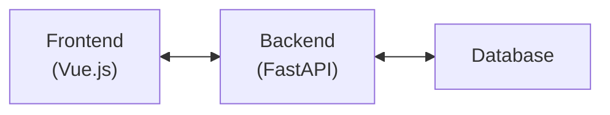
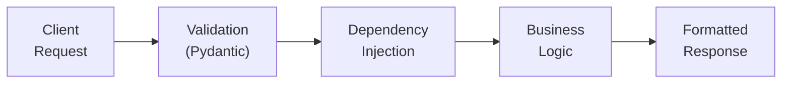
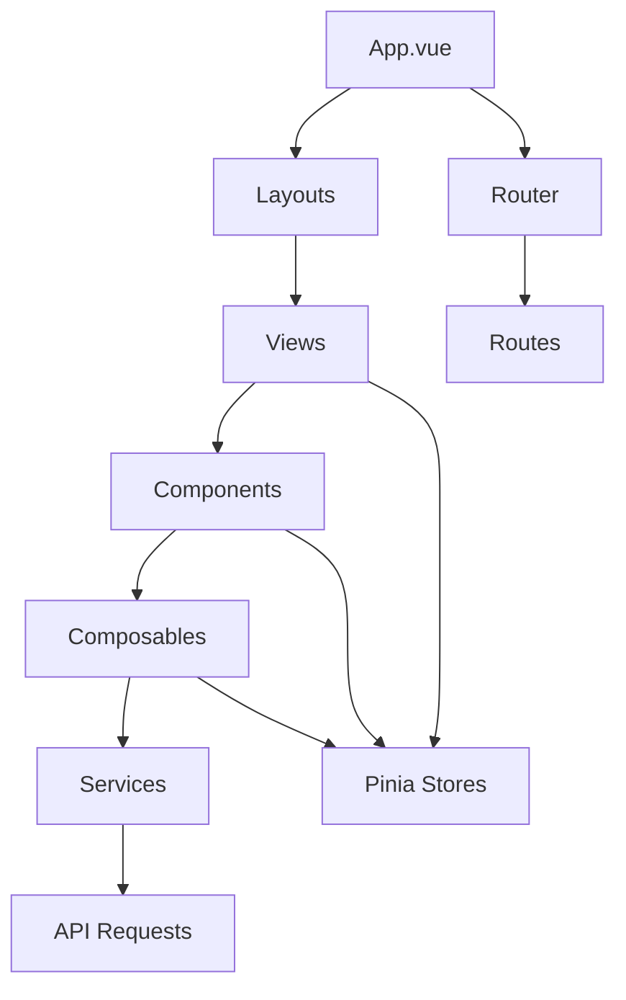
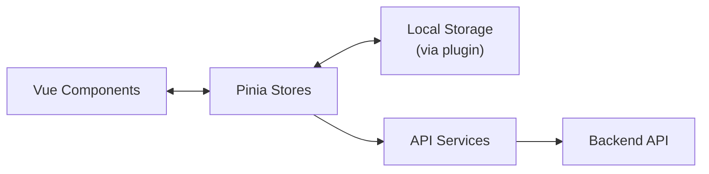
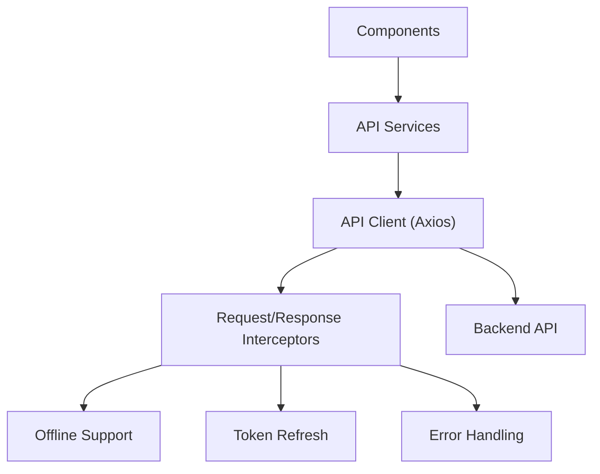
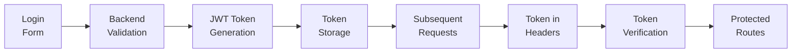
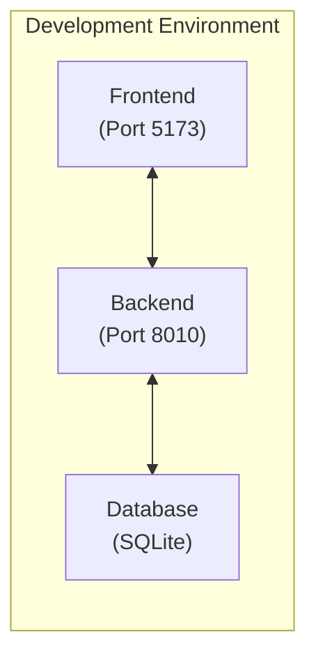
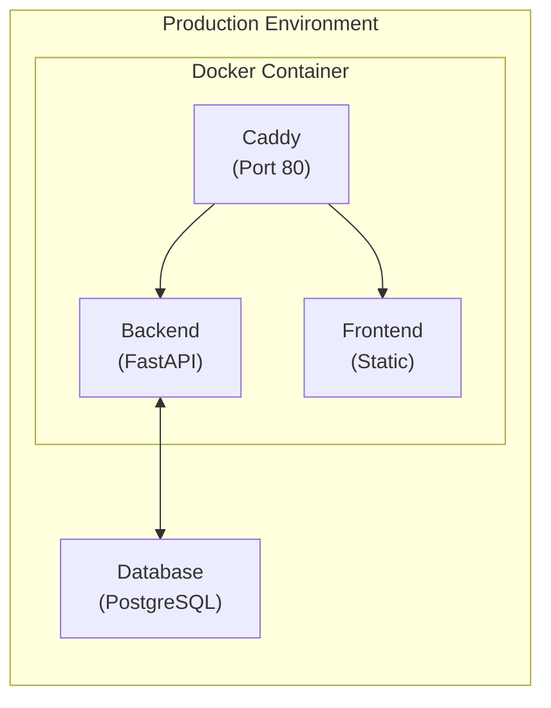
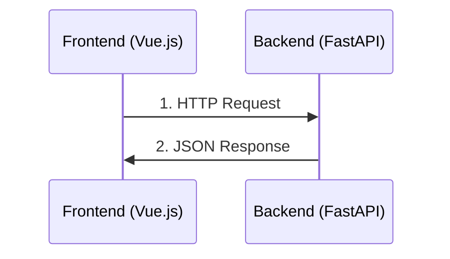
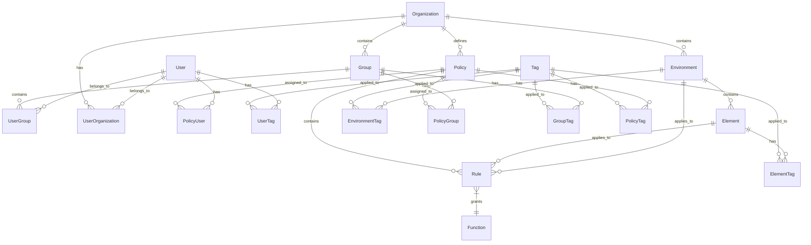

# Project Architecture

This document outlines the comprehensive architecture of the VesselHarbor project, including diagrams and detailed explanations of how different components interact.

## Overview

The application follows a modern client-server architecture with a clear separation between:



- **Backend**: FastAPI-based RESTful API
- **Frontend**: Vue.js 3 single-page application (SPA)
- **Deployment**: Docker containerization for both development and production

## Backend Architecture

### Technology Stack

- **Framework**: FastAPI (Python)
- **ORM**: SQLAlchemy with SQLite/PostgreSQL
- **Authentication**: JWT-based authentication
- **API Documentation**: Swagger UI and ReDoc (auto-generated)

### Directory Structure

```
app/
├── alembic/            # Database migrations
├── api/                # API endpoints
│   ├── auth.py         # Authentication endpoints
│   ├── users.py        # User management endpoints
│   ├── organizations.py # Organization management endpoints
│   ├── environments.py # Environment management endpoints
│   ├── elements.py     # Element management endpoints
│   ├── groups.py       # Group management endpoints
│   ├── policies.py     # Policy management endpoints
│   ├── rules.py        # Rule management endpoints
│   ├── functions.py    # Function management endpoints
│   ├── tags.py         # Tag management endpoints
│   ├── audit_logs.py   # Audit log endpoints
│   ├── health.py       # Health check endpoints
│   └── teapot.py       # Easter egg endpoint
├── core/               # Core application components
│   ├── auth.py         # Authentication core functionality
│   └── ...
├── database/           # Database configuration and session management
│   ├── base.py         # Base model configuration
│   ├── seed.py         # Database seeding
│   └── session.py      # Database session management
├── helper/             # Helper utilities
│   ├── audit.py        # Audit logging
│   ├── email.py        # Email functionality
│   ├── permissions.py  # Permission checking
│   ├── response.py     # Standardized response formatting
│   └── security.py     # Security utilities
├── models/             # SQLAlchemy models
│   ├── user.py         # User model
│   ├── organization.py # Organization model
│   ├── environment.py  # Environment model
│   ├── element.py      # Element model
│   ├── group.py        # Group model
│   ├── policy.py       # Policy model
│   ├── rule.py         # Rule model
│   ├── function.py     # Function model
│   ├── tag.py          # Tag model
│   └── audit_log.py    # Audit log model
├── repositories/       # Data access layer
│   ├── user_repo.py    # User repository
│   ├── tag_repo.py     # Tag repository
│   ├── group_repo.py   # Group repository
│   └── ...
├── schema/             # Pydantic schemas for validation
│   ├── user.py         # User schemas
│   ├── organization.py # Organization schemas
│   ├── environment.py  # Environment schemas
│   └── ...
├── tests/              # Test suite
└── main.py             # Application entry point
```

### Data Flow



1. The client sends an HTTP request to an API endpoint
2. The request is validated using Pydantic models
3. Dependencies are injected (auth, database session, etc.)
4. Business logic is executed in the service layer
5. The response is formatted and returned to the client

### API Endpoints

The API is structured with a base URL prefix of `/api/v1`. For detailed information about all available endpoints, request/response formats, and authentication requirements, see [API Endpoints Documentation](api-endpoints.md).

## Frontend Architecture

### Technology Stack

- **Framework**: Vue.js 3 with Composition API
- **State Management**: Pinia with persistence (pinia-plugin-persistedstate)
- **Routing**: Vue Router with auto-routes
- **UI Components**: Element Plus components with UnoCSS utility classes
- **HTTP Client**: Axios with interceptors for offline support
- **Testing**: Vitest (unit) and Playwright (e2e)
- **Icons**: Material Icons
- **Head Management**: Unhead for document head
- **Offline Support**: Custom offline synchronization system

### Directory Structure

```
frontend/
├── public/             # Static assets
├── src/
│   ├── assets/         # Images, fonts, etc.
│   ├── components/     # Reusable Vue components
│   ├── composables/    # Composition API hooks
│   ├── layouts/        # Page layouts
│   ├── pages/          # Page components (auto-routed)
│   ├── router/         # Vue Router configuration
│   ├── services/       # API service layer
│   ├── store/          # Pinia stores
│   ├── types/          # TypeScript type definitions
│   ├── utils/          # Utility functions
│   ├── views/          # View components
│   ├── App.vue         # Root component
│   └── main.ts         # Application entry point
└── tests/              # Test suite
```

### Component Architecture

The frontend follows a component-based architecture:



- **Layouts**: Define the overall structure of pages
- **Views**: Page-level components that compose smaller components
- **Components**: Reusable UI elements
- **Composables**: Reusable logic extracted into composition functions
- **Services**: Abstraction layer for API calls
- **Stores**: Global state management with Pinia
- **Types**: TypeScript type definitions for type safety

### State Management

The frontend uses Pinia for state management with a modular approach:



1. **Store Modules**:
   - **Auth Store**: Manages authentication state, user information, and permissions
   - **Notifications Store**: Manages application notifications and alerts
   - **Offline Sync Store**: Manages offline synchronization state and operations
   - **Entities Store**: Manages domain entities like users, environments, etc.
   - **Group Store**: Manages group-related state and operations

2. **Key Features**:
   - State persistence with pinia-plugin-persistedstate
   - TypeScript for type-safe state management
   - Computed properties (getters) for derived state
   - Actions for asynchronous operations
   - Composition API integration for easy store access

3. **State Persistence**:
   - Selected stores persisted to localStorage
   - Automatic rehydration on page reload
   - Configurable persistence options per store

### API Service Layer

The frontend uses a well-structured API service layer to communicate with the backend:



1. **Base API Client**:
   - Centralized Axios instance with common configuration
   - Base URL from environment variables
   - Default headers and timeout settings
   - Credentials included in requests

2. **Request/Response Interceptors**:
   - Token refresh for 401 errors
   - Offline detection and handling
   - Response caching for offline use
   - Error handling with notifications

3. **Offline Support**:
   - GET requests: Fallback to cached responses when offline
   - POST/PUT/DELETE requests: Queue for later execution
   - Automatic synchronization when back online
   - Pending actions count and status tracking

4. **Service Modules**:
   - Separate service modules for different API endpoints
   - Type-safe request and response handling
   - Business logic abstraction
   - Error handling and transformation

### Routing Structure

The frontend uses Vue Router to manage navigation. The main routes include:

- `/login` - Login page
- `/forgot-password` - Password recovery page
- `/reset-password` - Password reset page
- `/` - Dashboard (requires authentication)
- `/account` - User account management (requires authentication)
- `/environment/:envId/elements` - Environment elements (requires authentication)
- `/environment/:envId/manage` - Environment management (requires environment admin role)
- `/environment/:envId/users` - Environment users (requires environment admin role)
- `/users` - User management (requires superadmin role)
- `/users/:id` - Detailed user view (requires superadmin role)

## Authentication Flow



1. User submits credentials via login form
2. Backend validates credentials and issues JWT token
3. Frontend stores token in localStorage/cookie
4. Token is included in Authorization header for subsequent requests
5. Protected routes check for valid token before rendering

For detailed information about the authentication system and role-based access control, see [Authentication Documentation](authentication.md).

## Deployment Architecture

### Development Environment



- Backend and frontend run as separate services
- Hot-reloading enabled for both
- Local database for development

### Production Environment



- Single Docker image containing both backend and frontend
- Caddy as reverse proxy and static file server
- Environment variables for configuration
- Optional Kubernetes deployment via Helm charts

## Component Communication



- Frontend communicates with backend via RESTful API calls
- API responses follow a consistent JSON structure
- Error handling is standardized across the application

## Data Model

The application uses a comprehensive data model to represent the various entities and their relationships. Here's an overview of the key entities:

### Core Entities



### Key Entities Description

1. **User**: Represents a user of the system with authentication credentials and basic profile information.
   - Attributes: id, username, first_name, last_name, email, hashed_password, is_superadmin
   - Relationships: Many-to-many with Group, Organization, Policy, and Tag

2. **Organization**: Top-level container that groups environments, users, and policies.
   - Attributes: id, name, description
   - Relationships: One-to-many with Environment, Group, and Policy; Many-to-many with User

3. **Environment**: Container for elements within an organization.
   - Attributes: id, name, description, organization_id
   - Relationships: Many-to-one with Organization; One-to-many with Element and Rule; Many-to-many with Tag

4. **Element**: Basic unit within an environment (represents a container, VM, or other resource).
   - Attributes: id, name, description, environment_id
   - Relationships: Many-to-one with Environment; One-to-many with Rule; Many-to-many with Tag

5. **Group**: Collection of users for easier permission management.
   - Attributes: id, name, description, organization_id
   - Relationships: Many-to-one with Organization; Many-to-many with User, Policy, and Tag

6. **Policy**: Collection of rules that define access permissions.
   - Attributes: id, name, description, organization_id
   - Relationships: Many-to-one with Organization; One-to-many with Rule; Many-to-many with User, Group, and Tag

7. **Rule**: Defines what function can be performed on which resource.
   - Attributes: id, policy_id, function_id, environment_id, element_id, access_schedule
   - Relationships: Many-to-one with Policy, Function, Environment, and Element

8. **Function**: Represents an operation or permission that can be granted.
   - Attributes: id, name, description
   - Relationships: One-to-many with Rule

9. **Tag**: Label that can be applied to various entities for dynamic access control.
   - Attributes: id, name, description
   - Relationships: Many-to-many with User, Group, Policy, Element, and Environment

10. **AuditLog**: Record of actions performed in the system for auditing purposes.
    - Attributes: id, user_id, action, details, timestamp
    - Relationships: Many-to-one with User

For detailed information about the database schema and entity relationships, see the [Database Schema](database.mmd) diagram.
