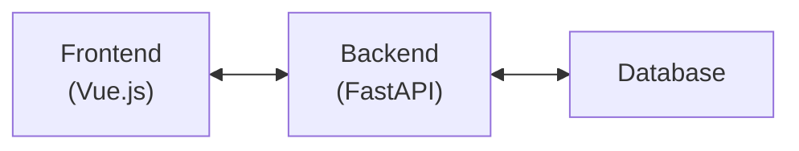
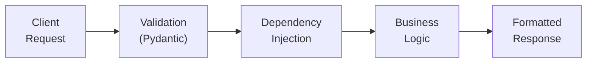
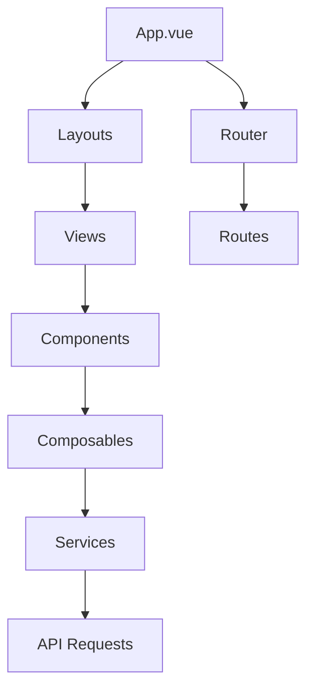
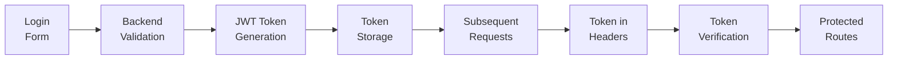
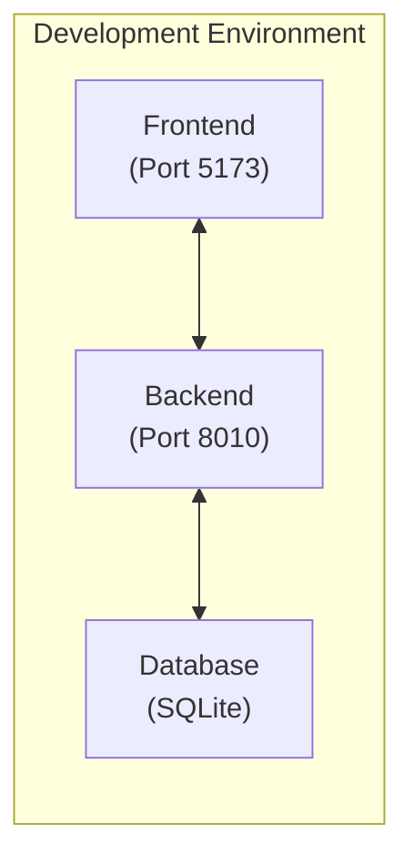
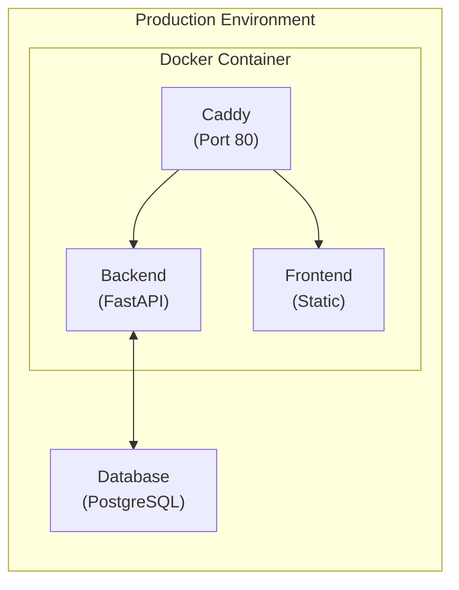
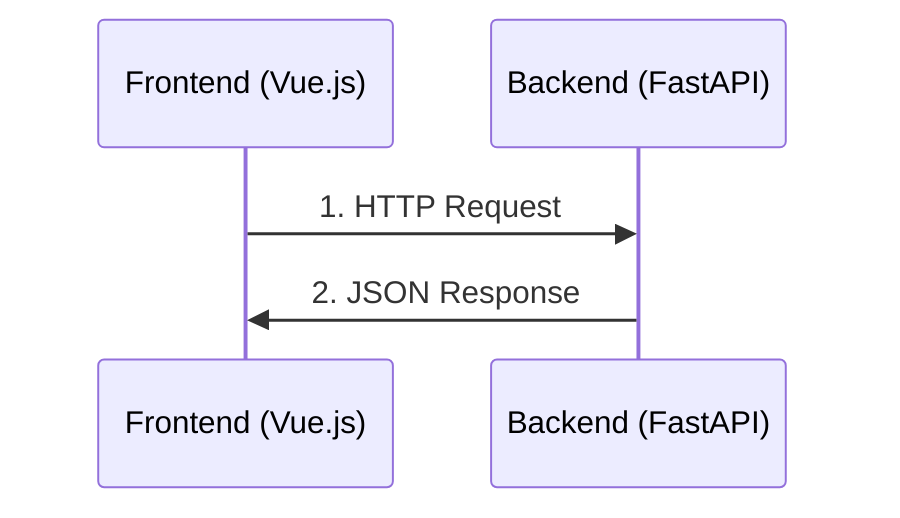

# Project Architecture

This document outlines the comprehensive architecture of the VesselHarbor project, including diagrams and detailed explanations of how different components interact.

## Overview

The application follows a modern client-server architecture with a clear separation between:



- **Backend**: FastAPI-based RESTful API
- **Frontend**: Vue.js 3 single-page application (SPA)
- **Deployment**: Docker containerization for both development and production

## Backend Architecture

### Technology Stack

- **Framework**: FastAPI (Python)
- **ORM**: SQLAlchemy with SQLite/PostgreSQL
- **Authentication**: JWT-based authentication
- **API Documentation**: Swagger UI and ReDoc (auto-generated)

### Directory Structure

```
app/
├── alembic/            # Database migrations
├── api/                # API endpoints
│   ├── deps.py         # Dependency injection
│   ├── routes/         # API route definitions
│   └── ...
├── core/               # Core application components
│   ├── config.py       # Configuration management
│   ├── security.py     # Security utilities
│   └── ...
├── db/                 # Database models and session management
├── models/             # Pydantic models for request/response
├── schemas/            # Pydantic schemas for validation
├── services/           # Business logic
├── tests/              # Test suite
└── main.py             # Application entry point
```

### Data Flow



1. The client sends an HTTP request to an API endpoint
2. The request is validated using Pydantic models
3. Dependencies are injected (auth, database session, etc.)
4. Business logic is executed in the service layer
5. The response is formatted and returned to the client

### API Endpoints

The API is structured with a base URL prefix of `/api/v1`. For detailed information about all available endpoints, request/response formats, and authentication requirements, see [API Endpoints Documentation](api-endpoints.md).

## Frontend Architecture

### Technology Stack

- **Framework**: Vue.js 3 with Composition API
- **State Management**: Pinia
- **Routing**: Vue Router
- **UI Components**: Custom components with UnoCSS
- **HTTP Client**: Axios
- **Testing**: Vitest (unit) and Playwright (e2e)

### Directory Structure

```
frontend/
├── public/             # Static assets
├── src/
│   ├── assets/         # Images, fonts, etc.
│   ├── components/     # Reusable Vue components
│   ├── composables/    # Composition API hooks
│   ├── layouts/        # Page layouts
│   ├── pages/          # Page components (auto-routed)
│   ├── router/         # Vue Router configuration
│   ├── services/       # API service layer
│   ├── store/          # Pinia stores
│   ├── types/          # TypeScript type definitions
│   ├── utils/          # Utility functions
│   ├── views/          # View components
│   ├── App.vue         # Root component
│   └── main.ts         # Application entry point
└── tests/              # Test suite
```

### Component Architecture

The frontend follows a component-based architecture:



- **Layouts**: Define the overall structure of pages
- **Views**: Page-level components that compose smaller components
- **Components**: Reusable UI elements
- **Composables**: Reusable logic extracted into composition functions
- **Services**: Abstraction layer for API calls
- **Stores**: Global state management with Pinia

### Routing Structure

The frontend uses Vue Router to manage navigation. The main routes include:

- `/login` - Login page
- `/forgot-password` - Password recovery page
- `/reset-password` - Password reset page
- `/` - Dashboard (requires authentication)
- `/account` - User account management (requires authentication)
- `/environment/:envId/elements` - Environment elements (requires authentication)
- `/environment/:envId/manage` - Environment management (requires environment admin role)
- `/environment/:envId/users` - Environment users (requires environment admin role)
- `/users` - User management (requires superadmin role)
- `/users/:id` - Detailed user view (requires superadmin role)

## Authentication Flow



1. User submits credentials via login form
2. Backend validates credentials and issues JWT token
3. Frontend stores token in localStorage/cookie
4. Token is included in Authorization header for subsequent requests
5. Protected routes check for valid token before rendering

For detailed information about the authentication system and role-based access control, see [Authentication Documentation](authentication.md).

## Deployment Architecture

### Development Environment



- Backend and frontend run as separate services
- Hot-reloading enabled for both
- Local database for development

### Production Environment



- Single Docker image containing both backend and frontend
- Caddy as reverse proxy and static file server
- Environment variables for configuration
- Optional Kubernetes deployment via Helm charts

## Component Communication



- Frontend communicates with backend via RESTful API calls
- API responses follow a consistent JSON structure
- Error handling is standardized across the application

## Data Model

For detailed information about the database schema and entity relationships, see the [Database Schema](database.mmd) diagram.
