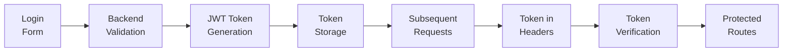
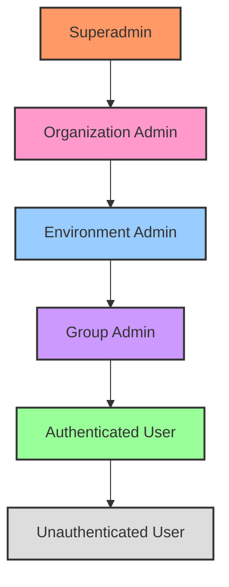
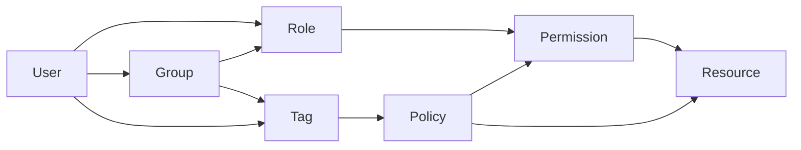
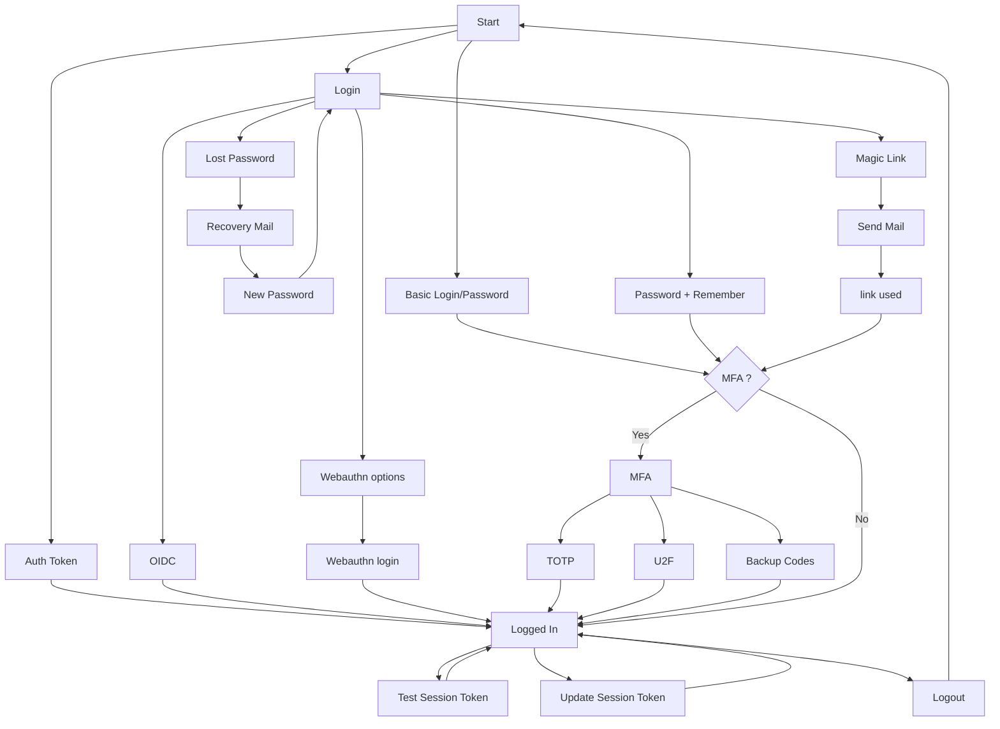
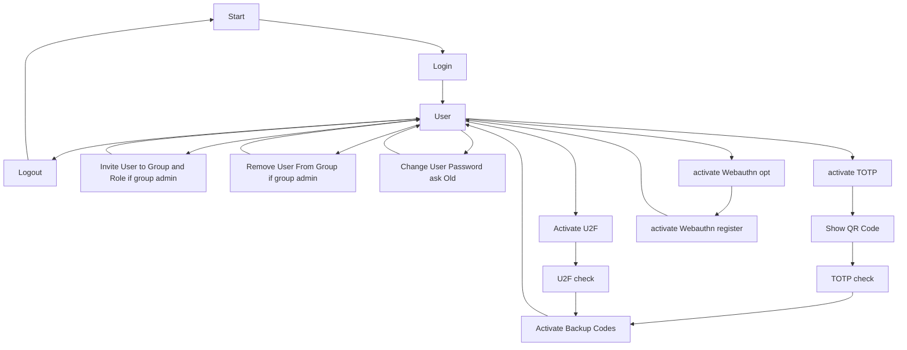
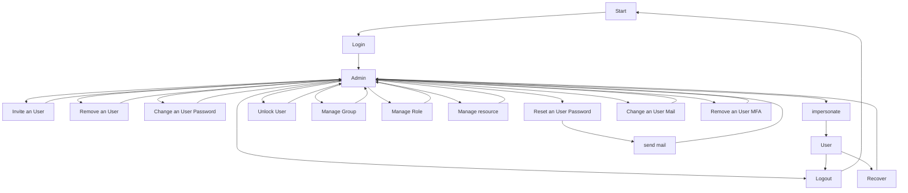
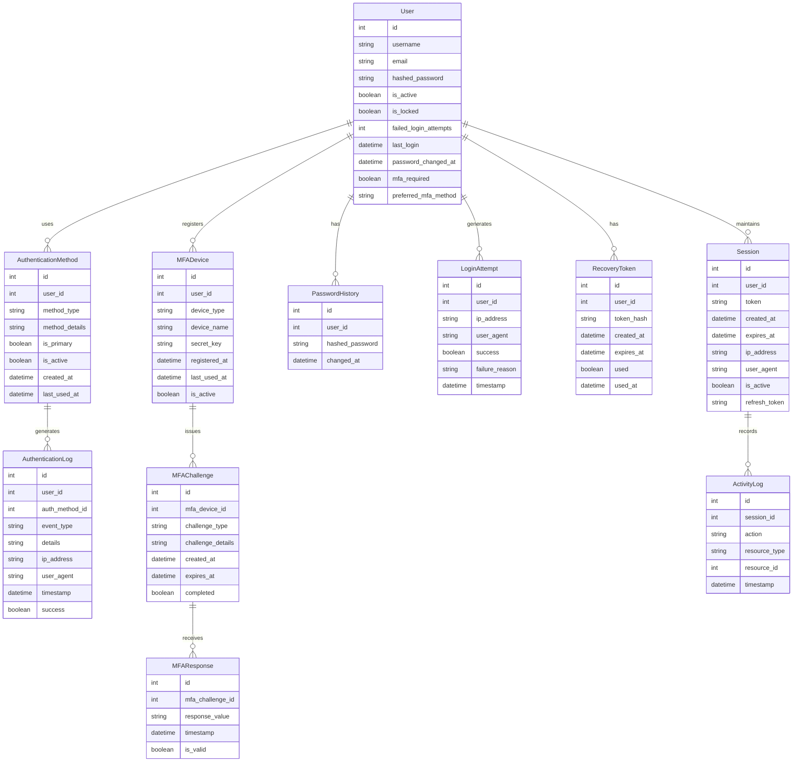
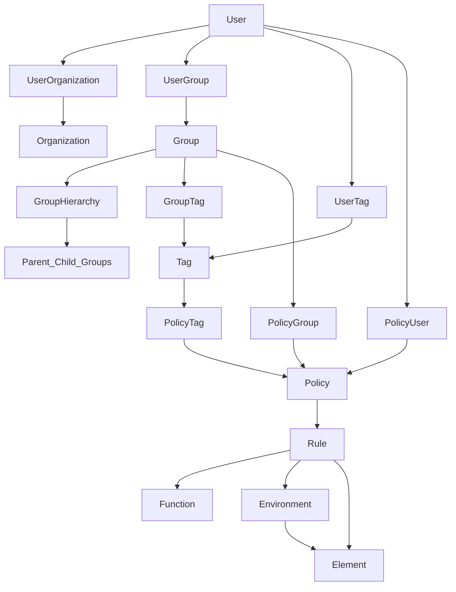
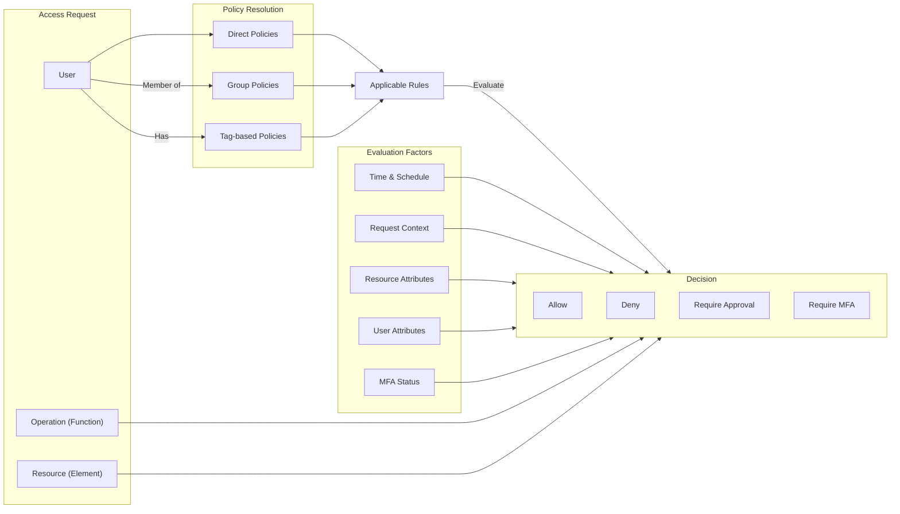

## Authentication Flow

1. The user submits credentials via the login form
2. The backend validates the credentials and issues a JWT token
3. The frontend stores the token in localStorage/cookie
4. The token is included in the Authorization header for subsequent requests
5. Protected routes check for valid token before rendering

## Role-Based Access Control (RBAC)

The application implements a comprehensive role-based access control (RBAC) system that follows the principle of least privilege and provides fine-grained access control to resources.

### Core RBAC Components

1. **Users**: Individuals who need access to the system
2. **Roles**: Collections of permissions assigned to users
3. **Permissions**: Rights to perform specific operations on resources
4. **Resources**: System entities that users need to access
5. **Policies**: Rules that define what operations are allowed on which resources
6. **Organizations**: Top-level containers that group environments, users, and policies
7. **Groups**: Collections of users for easier permission management
8. **Tags**: Labels that can be applied to users, groups, or policies for dynamic access control

### Role Hierarchy

The system implements a hierarchical role structure:

### Role Definitions and Permissions

1. **Unauthenticated User**:
   - Access to public pages (login, password recovery)
   - No access to protected resources

2. **Authenticated User**:
   - All permissions of Unauthenticated User
   - Access to the dashboard
   - View and manage their own account
   - View environments they have access to
   - View elements within accessible environments
   - Execute functions on elements according to assigned policies

3. **Group Admin**:
   - All permissions of Authenticated User
   - Invite users to groups they administer
   - Remove users from groups they administer
   - Assign roles to users within their groups
   - View group activity logs

4. **Environment Admin**:
   - All permissions of Group Admin
   - Create, update, and delete elements within their environments
   - Manage environment-specific settings
   - View environment activity logs
   - Assign users and groups to environment-specific roles

5. **Organization Admin**:
   - All permissions of Environment Admin
   - Create, update, and delete environments within their organization
   - Create and manage groups within their organization
   - Define organization-wide policies
   - View organization-wide activity logs

6. **Superadmin**:
   - Full access to all features and resources
   - Manage all organizations
   - Create, update, and delete users
   - Assign users to organizations
   - View system-wide activity logs
   - Configure system settings

### Policy Enforcement

The RBAC system enforces access control through a policy-based approach:

1. **Policy Definition**: Policies define what operations (functions) can be performed on which resources (elements) under what conditions.

2. **Policy Assignment**: Policies can be assigned to:
   - Individual users (direct assignment)
   - Groups (inherited by all group members)
   - Tags (applied to all tagged entities)

3. **Access Evaluation Process**:
   - When a user attempts to access a resource, the system:
     1. Identifies the user
     2. Retrieves all roles assigned to the user (directly or via groups)
     3. Retrieves all policies applicable to the user (directly, via groups, or via tags)
     4. Evaluates if any policy allows the requested operation on the resource
     5. Grants or denies access based on the evaluation result

4. **Contextual Access Control**: Policies can include conditions based on:
   - Time of access (access_schedule)
   - User attributes
   - Resource attributes
   - Environmental factors (IP address, device, etc.)

### Separation of Duties

The RBAC system implements separation of duties to prevent conflicts of interest:

1. **Static Separation of Duties**: Certain role combinations cannot be assigned to the same user
2. **Dynamic Separation of Duties**: Certain operations require multiple users with different roles

### Least Privilege Principle

The system follows the principle of least privilege:

1. Users are granted the minimum permissions necessary to perform their tasks
2. Permissions are granted through roles rather than directly to users
3. Role assignments are regularly reviewed and updated

# Authentication Schema

The authentication implements the following flows:

* Basic authentication
* Simple OAuth2 with Password and Bearer
* Simple Connection Token
* OAuth2 with OIDC (google, github, keycloak, microsoft, generic)
* Two-factor authentication if activated with:
  * TOTP
  * U2F
  * Backup codes
* Webauthn
* Magic Link (Mail with a login link) with or without TFA
* Recovery mail to reset password
* Test session token
* Update session Token
* Logout

## Login Workflow

The login workflow is the following:

## User and Admin Rights and Flows

The flowchart below shows the user(and admin) rights and flows:

## Admin Flows

The authentication implements the following Admin flows:

* Invitation mail to invite a new user
* Registration of new user (without sending mail)
* Remove user
* Password change (set new password)
* Password reset create a link to reset password and optionally send mail
* unlock user

The following workflow shows what you can do as an Admin:

## Group Management

Groups implements the following flows for Admins:

* Create group
* Invite user to group with roles
* Remove user from group
* Remove Role from a user for a group

## Role Management

Roles implements the following flows for Admins:

* Create role
* Remove role
* add rights to role

## Data Model

The authentication system is built on a robust data model that supports multiple authentication methods, session management, and fine-grained access control.

### Authentication Entities

### Key Authentication Entities

1. **User**
   - Central entity for authentication
   - Stores username, email, and hashed password
   - Tracks account status (active, locked)
   - Monitors login attempts and password changes
   - Configures MFA requirements

2. **AuthenticationMethod**
   - Represents different ways a user can authenticate
   - Types include password, TOTP, U2F, WebAuthn, OAuth providers
   - Users can have multiple methods with one marked as primary
   - Tracks when methods were created and last used

3. **Session**
   - Represents an active user session
   - Contains authentication token and refresh token
   - Records context information (IP, user agent)
   - Has creation and expiration timestamps
   - Can be invalidated for security reasons

4. **PasswordHistory**
   - Stores previous password hashes
   - Used to prevent password reuse
   - Maintains timestamp of when passwords were changed
   - Supports password rotation policies

5. **LoginAttempt**
   - Records all authentication attempts
   - Captures success or failure with reason
   - Stores context information for security analysis
   - Used for rate limiting and account lockout

6. **RecoveryToken**
   - Manages password reset and account recovery
   - Contains secure, time-limited tokens
   - Tracks usage to prevent token reuse
   - Supports secure account recovery workflows

7. **MFADevice**
   - Represents a registered multi-factor authentication device
   - Types include TOTP apps, security keys, and backup codes
   - Contains device-specific configuration
   - Tracks registration and usage

8. **MFAChallenge** and **MFAResponse**
   - Manage the challenge-response flow for MFA
   - Support different types of challenges
   - Enforce time limits on challenges
   - Verify response validity

9. **AuthenticationLog**
   - Detailed logging of all authentication events
   - Records method used, success/failure, and context
   - Critical for security monitoring and compliance
   - Supports forensic investigation

10. **ActivityLog**
    - Tracks user actions within a session
    - Links activities to authenticated sessions
    - Provides audit trail for user actions
    - Supports behavioral analysis

### Authentication and Authorization Flow

The authentication system implements a multi-layered approach:

1. **Primary Authentication**
   - Username/password verification
   - OAuth 2.0 with supported providers
   - WebAuthn passwordless authentication

2. **Secondary Authentication (MFA)**
   - TOTP verification
   - U2F/WebAuthn security key verification
   - Backup code verification

3. **Session Management**
   - JWT token issuance with appropriate claims
   - Refresh token rotation
   - Session validation on each request
   - Context-based session validation

4. **Authorization**
   - Role-based access control
   - Policy evaluation
   - Context-aware permission checks
   - Just-in-time privilege elevation

### Security Features

The authentication system implements numerous security features:

1. **Credential Protection**
   - Argon2id password hashing
   - Secure key storage for MFA secrets
   - Breached password detection
   - Password complexity enforcement

2. **Account Protection**
   - Rate limiting on authentication attempts
   - Progressive delays on failed attempts
   - Account lockout with administrative unlock
   - Suspicious activity detection

3. **Session Security**
   - Short-lived access tokens
   - Secure token storage
   - Cross-site request forgery protection
   - Session binding to context

4. **Recovery Security**
   - Time-limited recovery tokens
   - Out-of-band verification
   - Notification of recovery attempts
   - Audit logging of all recovery events
### Relationship Flows

#### User Access Flow

This flow shows how a user's access permissions are determined through:
1. Direct policy assignments
2. Group memberships and inherited policies
3. Tags applied to the user or their groups
4. Organizational context
5. Rules that connect policies to specific functions and resources

#### Policy Evaluation Flow

This flow illustrates how the system evaluates whether a user can perform a specific operation on a resource by:
1. Gathering all applicable policies from multiple sources
2. Evaluating rules against the requested operation and resource
3. Considering contextual factors like time, location, and user attributes
4. Making an access decision (allow, deny, require approval, or require additional authentication)

## Security Architecture and Considerations

The application implements state-of-the-art security practices across all layers to protect against common threats and vulnerabilities.

### Authentication Security

1. **Password Security**
   - Passwords are hashed using Argon2id (memory-hard function resistant to side-channel attacks)
   - Password complexity requirements enforced (minimum length, character variety)
   - Password history maintained to prevent reuse
   - Regular password rotation enforced for sensitive roles
   - Breached password detection using HaveIBeenPwned API

2. **Multi-Factor Authentication (MFA)**
   - TOTP (Time-based One-Time Password) implementation following RFC 6238
   - WebAuthn/FIDO2 support for passwordless and phishing-resistant authentication
   - U2F (Universal 2nd Factor) support for hardware security keys
   - Backup codes generated using cryptographically secure random number generator
   - MFA enforcement for privileged operations and sensitive environments

3. **Session Management**
   - JWT tokens with appropriate expiration times
   - Secure cookie configuration (HttpOnly, Secure, SameSite=Strict)
   - Session invalidation on password change or security event
   - Concurrent session limitations with visibility of active sessions
   - Session context validation (IP address, user agent fingerprinting)

4. **Account Protection**
   - Rate limiting on authentication attempts
   - Progressive delays on failed login attempts
   - Account lockout with administrative unlock
   - Notification of security events (login from new device, password change)
   - Secure account recovery with time-limited tokens

### Authorization Security

1. **Principle of Least Privilege**
   - Default deny for all access decisions
   - Fine-grained permissions based on resource and operation
   - Time-bound access grants with automatic expiration
   - Just-in-time privilege elevation with approval workflows
   - Regular access reviews and automated privilege reduction

2. **Separation of Duties**
   - Critical operations require multiple approvals
   - Administrative functions separated from regular user functions
   - Mutually exclusive roles to prevent conflicts of interest
   - Audit trails for all privilege changes
   - Segregation of development, test, and production environments

3. **Context-Aware Access Control**
   - Risk-based authentication decisions
   - Location and time-based access restrictions
   - Device posture assessment for sensitive operations
   - Behavioral analytics to detect anomalous access patterns
   - Adaptive security responses based on threat intelligence

### API Security

1. **Input Validation and Sanitization**
   - Schema-based validation using Pydantic
   - Content type validation and enforcement
   - Parameter binding with type checking
   - Output encoding to prevent injection attacks
   - API schema validation against OpenAPI specification

2. **Rate Limiting and Throttling**
   - Per-endpoint rate limits
   - User-based quotas
   - Graduated response to excessive requests
   - Backoff requirements for repeated failures
   - DDoS protection through rate limiting

3. **API Authentication and Authorization**
   - OAuth 2.0 with OpenID Connect for authentication
   - Scoped access tokens with minimal permissions
   - Token validation on every request
   - API keys with fine-grained permissions
   - Mutual TLS for service-to-service communication
