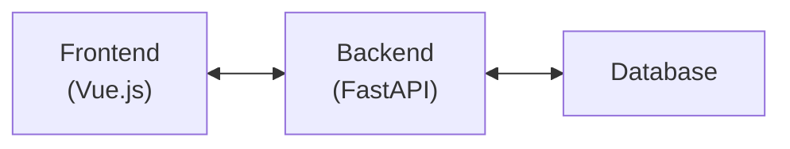
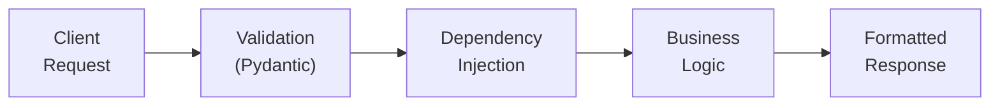
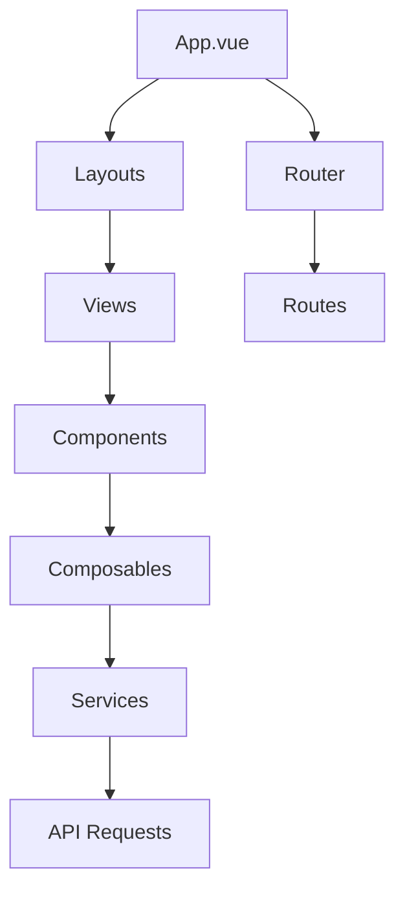
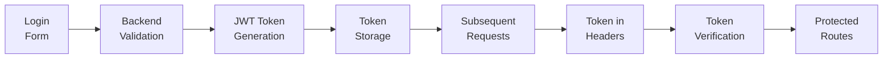
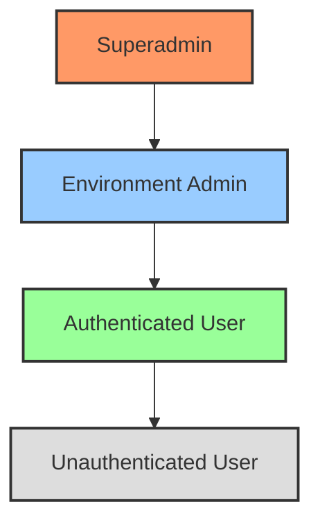
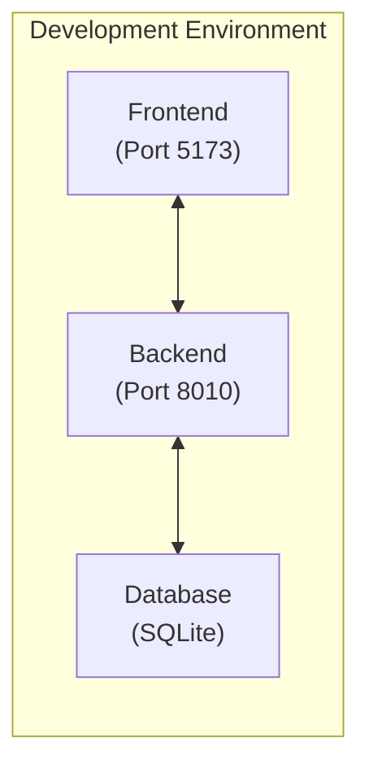
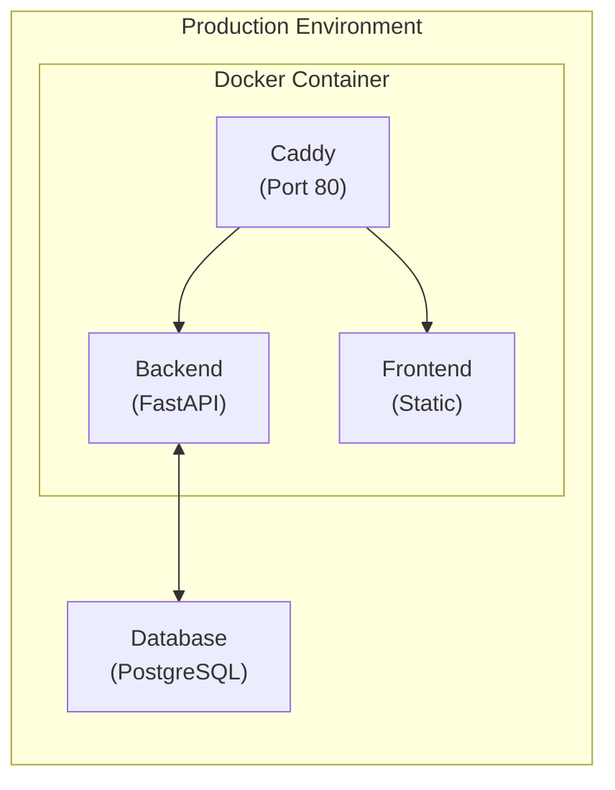
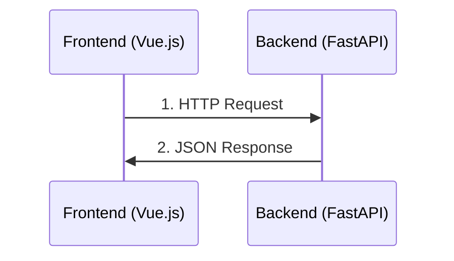
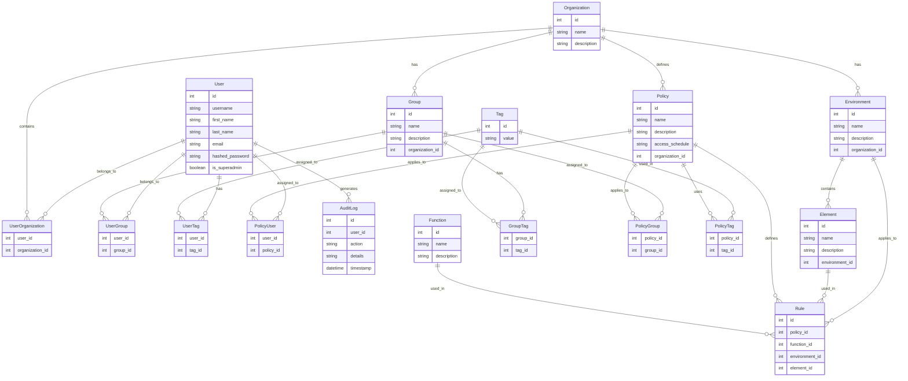

# Logical Architecture of the Application

This document presents the complete logical architecture of the FastAPI Vue Template application, describing how the different components interact with each other.

## Overview

The application follows a modern client-server architecture with a clear separation between:

- **Backend**: RESTful API based on FastAPI (Python)
- **Frontend**: Single Page Application (SPA) based on Vue.js 3
- **Deployment**: Docker containerization for development and production



## Backend Architecture

### Technology Stack

- **Framework**: FastAPI (Python)
- **ORM**: SQLAlchemy with SQLite/PostgreSQL
- **Authentication**: Based on JWT (JSON Web Tokens)
- **API Documentation**: Swagger UI and ReDoc (automatically generated)

### Directory Structure

```
app/
├── alembic/            # Database migrations
├── api/                # API endpoints
│   ├── deps.py         # Dependency injection
│   ├── routes/         # API route definitions
│   └── ...
├── core/               # Core application components
│   ├── config.py       # Configuration management
│   ├── security.py     # Security utilities
│   └── ...
├── db/                 # Database models and session management
├── models/             # Pydantic models for request/response
├── schemas/            # Pydantic schemas for validation
├── services/           # Business logic
├── tests/              # Test suite
└── main.py             # Application entry point
```

### Data Flow



1. The client sends an HTTP request to an API endpoint
2. The request is validated using Pydantic models
3. Dependencies are injected (auth, database session, etc.)
4. Business logic is executed in the service layer
5. The response is formatted and returned to the client

### API Endpoints

The API is structured with a base URL prefix of `/api/v1` and includes the following categories:

#### Authentication
- `/api/v1/auth/login` (POST) - User login
- `/api/v1/users/me` (GET) - Get current user

#### User Management
- `/api/v1/users/` (GET) - Get all users (Superadmin only)
- `/api/v1/users/{user_id}` (GET) - Get user by ID
- `/api/v1/users/` (POST) - Create user (Superadmin only)
- `/api/v1/users/{user_id}` (PUT) - Update user
- `/api/v1/users/{user_id}` (DELETE) - Delete user (Superadmin only)

#### Environment Management
- `/api/v1/environments/` (GET) - Get all environments
- `/api/v1/environments/{env_id}` (GET) - Get environment by ID
- `/api/v1/environments/` (POST) - Create environment
- `/api/v1/environments/{env_id}` (PUT) - Update environment (Environment admin only)
- `/api/v1/environments/{env_id}` (DELETE) - Delete environment (Environment admin only)

## Frontend Architecture

### Technology Stack

- **Framework**: Vue.js 3 with Composition API
- **State Management**: Pinia
- **Routing**: Vue Router
- **UI Components**: Custom components with UnoCSS
- **HTTP Client**: Axios
- **Testing**: Vitest (unit) and Playwright (e2e)

### Directory Structure

```
frontend/
├── public/             # Static assets
├── src/
│   ├── assets/         # Images, fonts, etc.
│   ├── components/     # Reusable Vue components
│   ├── composables/    # Composition API hooks
│   ├── layouts/        # Page layouts
│   ├── pages/          # Page components (auto-routed)
│   ├── router/         # Vue Router configuration
│   ├── services/       # API service layer
│   ├── store/          # Pinia stores
│   ├── types/          # TypeScript type definitions
│   ├── utils/          # Utility functions
│   ├── views/          # View components
│   ├── App.vue         # Root component
│   └── main.ts         # Application entry point
└── tests/              # Test suite
```

### Component Architecture

The frontend follows a component-based architecture:



- **Layouts**: Define the overall structure of pages
- **Views**: Page-level components that compose smaller components
- **Components**: Reusable UI elements
- **Composables**: Reusable logic extracted into composition functions
- **Services**: Abstraction layer for API calls
- **Stores**: Global state management with Pinia

### Routing Structure

The frontend uses Vue Router to manage navigation. The main routes include:

- `/login` - Login page
- `/forgot-password` - Password recovery page
- `/reset-password` - Password reset page
- `/` - Dashboard (requires authentication)
- `/account` - User account management (requires authentication)
- `/environment/:envId/elements` - Environment elements (requires authentication)
- `/environment/:envId/manage` - Environment management (requires environment admin role)
- `/environment/:envId/users` - Environment users (requires environment admin role)
- `/users` - User management (requires superadmin role)
- `/users/:id` - Detailed user view (requires superadmin role)

## Authentication Flow



1. The user submits credentials via the login form
2. The backend validates the credentials and issues a JWT token
3. The frontend stores the token in localStorage/cookie
4. The token is included in the Authorization header for subsequent requests
5. Protected routes check for valid token before rendering

## Role-Based Access Control

The application implements a role-based access control (RBAC) system:

- **Unauthenticated User**: Access only to public pages (login, password recovery)
- **Authenticated User**: Access to the dashboard and their own account
- **Environment Admin**: Access to manage their environment and the users of that environment
- **Superadmin**: Full access to all features, including user management



## Deployment Architecture

### Development Environment

- Backend and frontend run as separate services
- Hot-reloading enabled for both
- Local database for development



### Production Environment

- Single Docker image containing both backend and frontend
- Caddy as reverse proxy and static file server
- Environment variables for configuration
- Optional Kubernetes deployment via Helm charts



## Component Communication

- Frontend communicates with backend via RESTful API calls
- API responses follow a consistent JSON structure
- Error handling is standardized across the application



## Data Model

The main entities of the application and their relationships:



- **User**: Represents a system user with attributes like username, email, password, etc.
- **Organization**: Represents a company or department that owns environments, groups, and policies.
- **Environment**: Represents a deployment environment (e.g., production, staging) with elements.
- **Element**: Represents a component within an environment that can be accessed through policies.
- **Group**: Represents a collection of users for easier policy management.
- **Tag**: Represents a label that can be applied to users, groups, or policies for flexible categorization.
- **Policy**: Defines access rules for users, groups, or tags to perform functions on elements in environments.
- **Function**: Represents an operation that can be performed (e.g., read, write, execute).
- **Rule**: Connects policies to specific functions, environments, and elements.
- **AuditLog**: Records user actions for security and compliance purposes.

## Conclusion

This logical architecture allows for a clear separation of concerns, easy maintenance, and scalability. The FastAPI backend provides a performant and well-documented API, while the Vue.js frontend offers a responsive and modern user interface. The entire system is deployed via Docker to ensure consistency between development and production environments.
