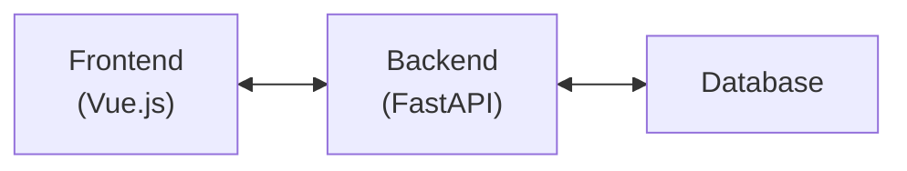
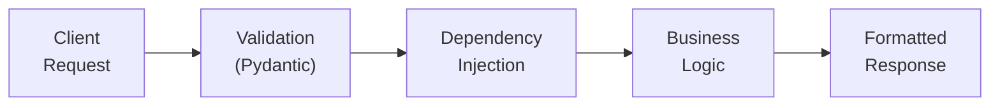
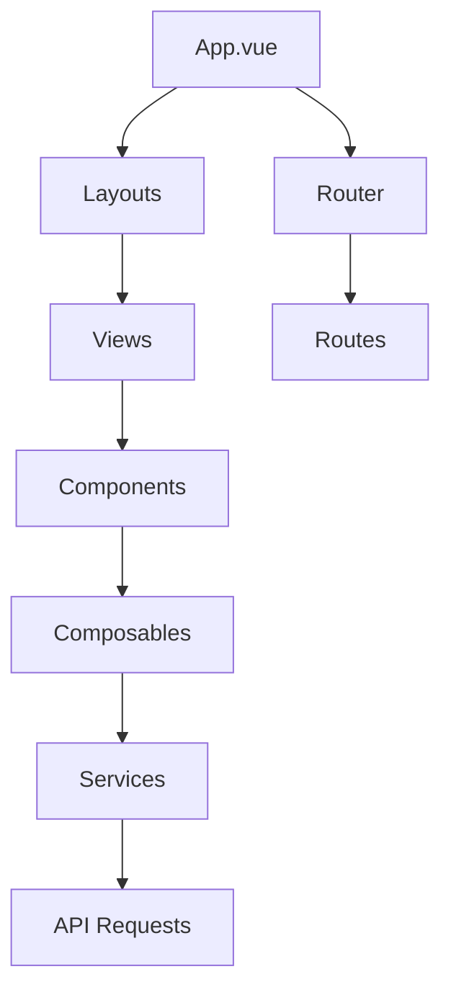
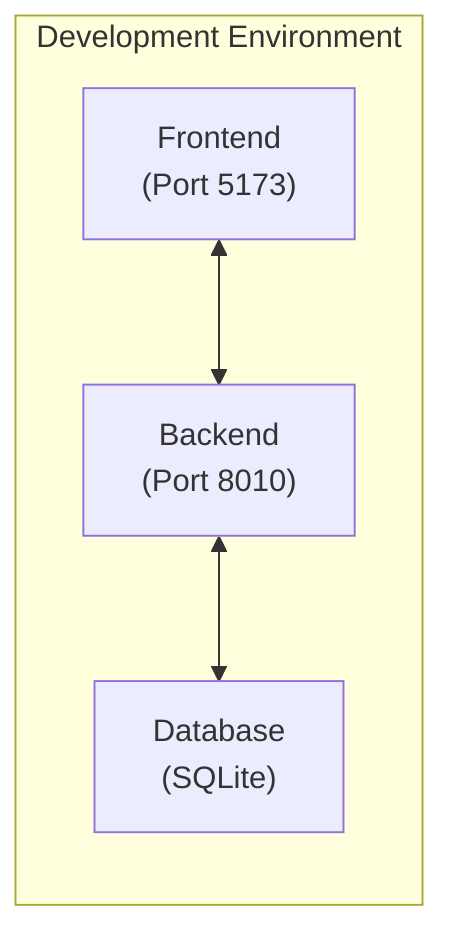
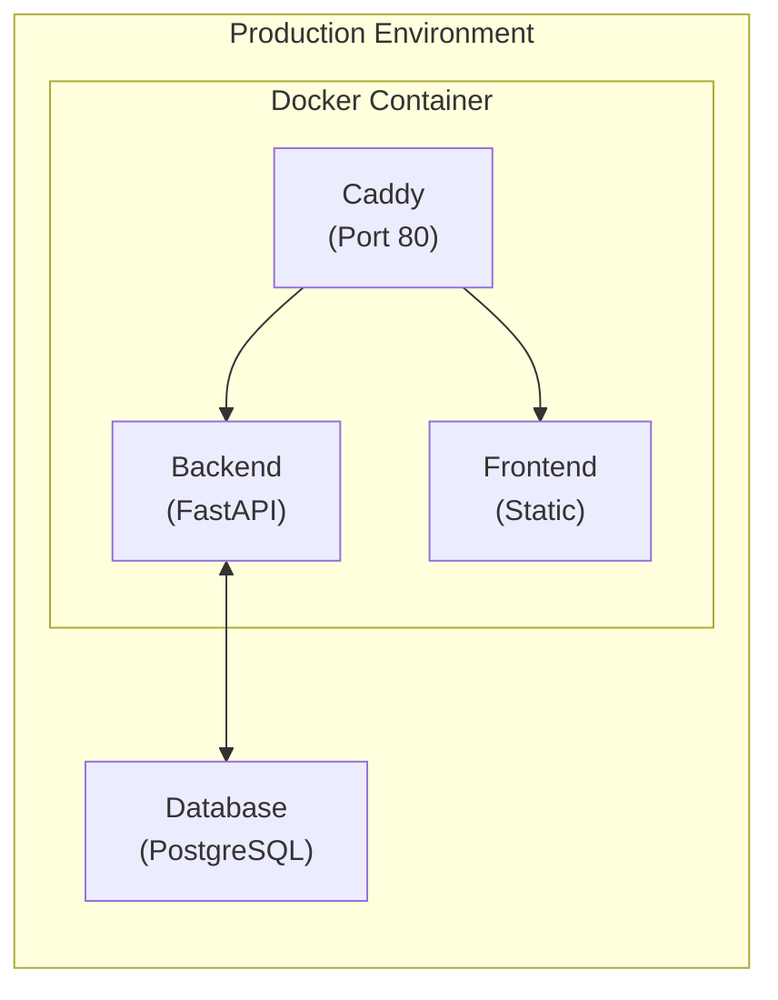
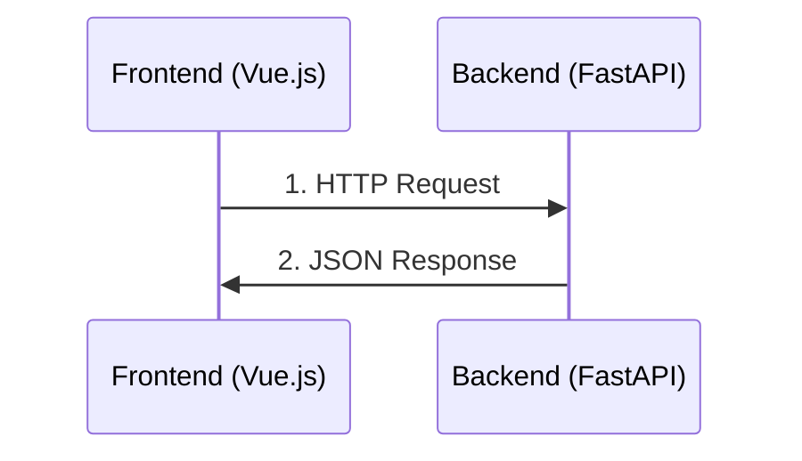
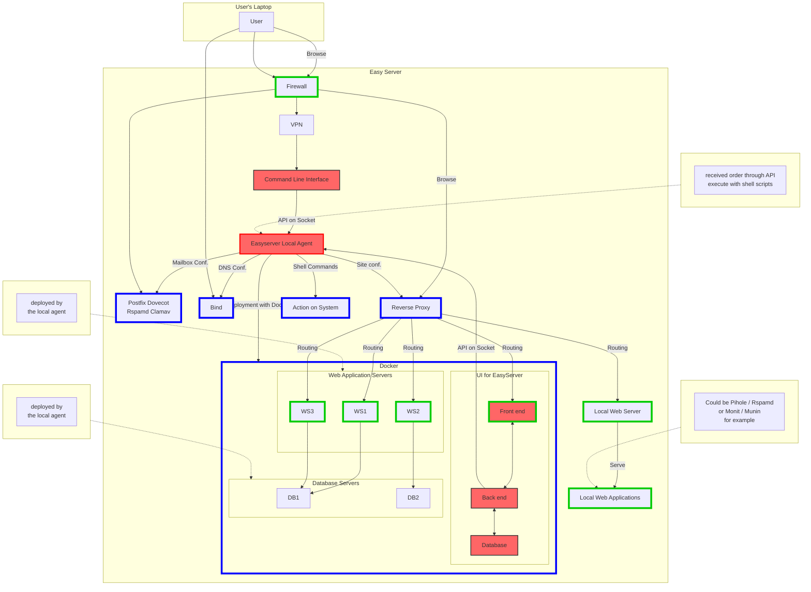

# Logical Architecture of the Application

This document presents the complete logical architecture of the FastAPI Vue Template application, describing how the different components interact with each other.

## Overview

The application follows a modern client-server architecture with a clear separation between:

- **Backend**: RESTful API based on FastAPI (Python)
- **Frontend**: Single Page Application (SPA) based on Vue.js 3
- **Deployment**: Docker containerization for development and production



## Backend Architecture

### Technology Stack

- **Framework**: FastAPI (Python)
- **ORM**: SQLAlchemy with SQLite/PostgreSQL
- **Authentication**: Based on JWT (JSON Web Tokens)
- **API Documentation**: Swagger UI and ReDoc (automatically generated)

### Directory Structure

```
app/
├── alembic/            # Database migrations
├── api/                # API endpoints
│   ├── deps.py         # Dependency injection
│   ├── routes/         # API route definitions
│   └── ...
├── core/               # Core application components
│   ├── config.py       # Configuration management
│   ├── security.py     # Security utilities
│   └── ...
├── db/                 # Database models and session management
├── models/             # Pydantic models for request/response
├── schemas/            # Pydantic schemas for validation
├── services/           # Business logic
├── tests/              # Test suite
└── main.py             # Application entry point
```

### Data Flow



1. The client sends an HTTP request to an API endpoint
2. The request is validated using Pydantic models
3. Dependencies are injected (auth, database session, etc.)
4. Business logic is executed in the service layer
5. The response is formatted and returned to the client

### API Endpoints

The API is structured with a base URL prefix of `/api/v1` and includes the following categories:

#### Authentication
- `/api/v1/auth/login` (POST) - User login
- `/api/v1/users/me` (GET) - Get current user

#### User Management
- `/api/v1/users/` (GET) - Get all users (Superadmin only)
- `/api/v1/users/{user_id}` (GET) - Get user by ID
- `/api/v1/users/` (POST) - Create user (Superadmin only)
- `/api/v1/users/{user_id}` (PUT) - Update user
- `/api/v1/users/{user_id}` (DELETE) - Delete user (Superadmin only)

#### Environment Management
- `/api/v1/environments/` (GET) - Get all environments
- `/api/v1/environments/{env_id}` (GET) - Get environment by ID
- `/api/v1/environments/` (POST) - Create environment
- `/api/v1/environments/{env_id}` (PUT) - Update environment (Environment admin only)
- `/api/v1/environments/{env_id}` (DELETE) - Delete environment (Environment admin only)

## Frontend Architecture

### Technology Stack

- **Framework**: Vue.js 3 with Composition API
- **State Management**: Pinia
- **Routing**: Vue Router
- **UI Components**: Custom components with UnoCSS
- **HTTP Client**: Axios
- **Testing**: Vitest (unit) and Playwright (e2e)

### Directory Structure

```
frontend/
├── public/             # Static assets
├── src/
│   ├── assets/         # Images, fonts, etc.
│   ├── components/     # Reusable Vue components
│   ├── composables/    # Composition API hooks
│   ├── layouts/        # Page layouts
│   ├── pages/          # Page components (auto-routed)
│   ├── router/         # Vue Router configuration
│   ├── services/       # API service layer
│   ├── store/          # Pinia stores
│   ├── types/          # TypeScript type definitions
│   ├── utils/          # Utility functions
│   ├── views/          # View components
│   ├── App.vue         # Root component
│   └── main.ts         # Application entry point
└── tests/              # Test suite
```

### Component Architecture

The frontend follows a component-based architecture:



- **Layouts**: Define the overall structure of pages
- **Views**: Page-level components that compose smaller components
- **Components**: Reusable UI elements
- **Composables**: Reusable logic extracted into composition functions
- **Services**: Abstraction layer for API calls
- **Stores**: Global state management with Pinia

### Routing Structure

The frontend uses Vue Router to manage navigation. The main routes include:

- `/login` - Login page
- `/forgot-password` - Password recovery page
- `/reset-password` - Password reset page
- `/` - Dashboard (requires authentication)
- `/account` - User account management (requires authentication)
- `/environment/:envId/elements` - Environment elements (requires authentication)
- `/environment/:envId/manage` - Environment management (requires environment admin role)
- `/environment/:envId/users` - Environment users (requires environment admin role)
- `/users` - User management (requires superadmin role)
- `/users/:id` - Detailed user view (requires superadmin role)

## Deployment Architecture

### Development Environment

- Backend and frontend run as separate services
- Hot-reloading enabled for both
- Local database for development



### Production Environment

- Single Docker image containing both backend and frontend
- Caddy as reverse proxy and static file server
- Environment variables for configuration
- Optional Kubernetes deployment via Helm charts



## Component Communication

- Frontend communicates with backend via RESTful API calls
- API responses follow a consistent JSON structure
- Error handling is standardized across the application



## Data Model and Entity Relationships

The application uses a sophisticated data model to represent the complex relationships between users, organizations, resources, and access control entities.

### Entity Relationship Diagram

```mermaid
erDiagram
    User ||--o{ UserOrganization : belongs_to
    User ||--o{ UserGroup : belongs_to
    User ||--o{ UserTag : has
    User ||--o{ PolicyUser : assigned_to
    User ||--o{ AuditLog : generates
    User ||--o{ AuthenticationMethod : uses
    User ||--o{ Session : maintains

    Organization ||--o{ UserOrganization : contains
    Organization ||--o{ Environment : has
    Organization ||--o{ Group : has
    Organization ||--o{ Policy : defines
    Organization ||--o{ OrganizationSettings : configures

    Environment ||--o{ Element : contains
    Environment ||--o{ Rule : applies_to
    Environment ||--o{ EnvironmentSettings : configures

    Element ||--o{ Rule : used_in
    Element ||--o{ ElementMetadata : has

    Group ||--o{ UserGroup : contains
    Group ||--o{ GroupTag : has
    Group ||--o{ PolicyGroup : assigned_to
    Group ||--o{ GroupHierarchy : participates_in

    Tag ||--o{ UserTag : assigned_to
    Tag ||--o{ GroupTag : assigned_to
    Tag ||--o{ PolicyTag : used_in

    Policy ||--o{ PolicyUser : applies_to
    Policy ||--o{ PolicyGroup : applies_to
    Policy ||--o{ PolicyTag : uses
    Policy ||--o{ Rule : defines
    Policy ||--o{ PolicyCondition : constrained_by

    Function ||--o{ Rule : used_in
    Function ||--o{ FunctionCategory : belongs_to

    User {
        int id
        string username
        string first_name
        string last_name
        string email
        string hashed_password
        boolean is_active
        boolean is_superadmin
        datetime last_login
        datetime password_changed_at
        int failed_login_attempts
        boolean is_locked
    }

    Organization {
        int id
        string name
        string description
        string domain
        boolean is_active
        datetime created_at
    }

    Environment {
        int id
        string name
        string description
        int organization_id
        string environment_type
        boolean is_production
        boolean is_active
    }

    Element {
        int id
        string name
        string description
        int environment_id
        string element_type
        string connection_details
        boolean is_active
    }

    Group {
        int id
        string name
        string description
        int organization_id
        boolean is_system_group
        boolean is_active
    }

    Tag {
        int id
        string value
        string category
        string description
    }

    Policy {
        int id
        string name
        string description
        string access_schedule
        int organization_id
        datetime valid_from
        datetime valid_until
        boolean requires_approval
        boolean is_active
    }

    Function {
        int id
        string name
        string description
        string category
        boolean is_dangerous
        boolean requires_2fa
    }

    Rule {
        int id
        int policy_id
        int function_id
        int environment_id
        int element_id
        boolean is_allowed
        string conditions
    }

    UserOrganization {
        int user_id
        int organization_id
        string role
        datetime joined_at
    }

    UserGroup {
        int user_id
        int group_id
        string role
        datetime joined_at
    }

    UserTag {
        int user_id
        int tag_id
        datetime assigned_at
    }

    GroupTag {
        int group_id
        int tag_id
        datetime assigned_at
    }

    PolicyUser {
        int user_id
        int policy_id
        datetime assigned_at
        datetime expires_at
    }

    PolicyGroup {
        int policy_id
        int group_id
        datetime assigned_at
        datetime expires_at
    }

    PolicyTag {
        int policy_id
        int tag_id
        datetime assigned_at
    }

    AuditLog {
        int id
        int user_id
        string action
        string details
        string resource_type
        int resource_id
        string ip_address
        string user_agent
        datetime timestamp
        boolean is_success
    }

    Session {
        int id
        int user_id
        string token
        datetime created_at
        datetime expires_at
        string ip_address
        string user_agent
        boolean is_active
    }

    AuthenticationMethod {
        int id
        int user_id
        string method_type
        string method_details
        boolean is_primary
        boolean is_active
    }

    PolicyCondition {
        int id
        int policy_id
        string condition_type
        string condition_value
    }

    GroupHierarchy {
        int parent_group_id
        int child_group_id
    }

    OrganizationSettings {
        int id
        int organization_id
        string setting_key
        string setting_value
    }

    EnvironmentSettings {
        int id
        int environment_id
        string setting_key
        string setting_value
    }

    ElementMetadata {
        int id
        int element_id
        string metadata_key
        string metadata_value
    }

    FunctionCategory {
        int id
        string name
        string description
    }
```



### Key Entities and Their Relationships

#### Core Identity and Organization Entities

1. **User**
   - Represents an individual who interacts with the system
   - Has attributes for authentication (username, password) and identification (name, email)
   - Security attributes include failed login attempts, account locking, and password change tracking
   - Can belong to multiple organizations through UserOrganization
   - Can belong to multiple groups through UserGroup
   - Can have multiple tags through UserTag
   - Can be directly assigned policies through PolicyUser
   - Generates audit logs for accountability
   - Can have multiple authentication methods (password, MFA, etc.)
   - Maintains active sessions

2. **Organization**
   - Top-level container entity representing a company or department
   - Contains environments, groups, and defines policies
   - Has configurable settings through OrganizationSettings
   - Users can belong to multiple organizations with different roles

3. **Environment**
   - Represents a deployment context (e.g., production, staging, development)
   - Belongs to an organization
   - Contains elements that can be accessed
   - Has configurable settings through EnvironmentSettings
   - Can be marked as production for special handling

4. **Element**
   - Represents a specific resource or component within an environment
   - Can be accessed through policies and rules
   - Has metadata for additional properties
   - Examples include servers, databases, applications, or services

#### Access Control Entities

5. **Group**
   - Collection of users for easier permission management
   - Belongs to an organization
   - Can have hierarchical relationships with other groups
   - Can have tags for dynamic policy application
   - Can be assigned policies through PolicyGroup
   - System groups are predefined and cannot be modified

6. **Tag**
   - Label that can be applied to users, groups, or policies
   - Enables dynamic policy application based on attributes
   - Has categories for organization (e.g., department, role, location)
   - Provides flexibility in access control without modifying group memberships

7. **Policy**
   - Defines access rules for users, groups, or tags
   - Belongs to an organization
   - Has validity period (valid_from, valid_until)
   - Can include access schedules (e.g., business hours only)
   - May require approval for certain operations
   - Can have additional conditions through PolicyCondition
   - Connected to specific functions, environments, and elements through rules

8. **Function**
   - Represents an operation that can be performed on elements
   - Examples include read, write, execute, delete, configure
   - Can be categorized (e.g., administrative, operational, reporting)
   - Can be flagged as dangerous, requiring additional verification
   - May require 2FA for execution

9. **Rule**
   - Connects policies to specific functions, environments, and elements
   - Defines whether an operation is allowed or denied
   - Can include additional conditions for fine-grained control
   - Forms the core of the access control decision

#### Security and Audit Entities

10. **AuditLog**
    - Records user actions for security and compliance
    - Includes details about the action, affected resource, and context
    - Captures IP address and user agent for forensic purposes
    - Records success or failure of operations
    - Critical for compliance and security investigations

11. **Session**
    - Represents a user's active session in the system
    - Has a token for authentication
    - Includes creation and expiration timestamps
    - Records IP address and user agent for security monitoring
    - Can be invalidated for security purposes

12. **AuthenticationMethod**
    - Represents the ways a user can authenticate
    - Includes password, TOTP, U2F, WebAuthn, etc.
    - Users can have multiple methods with one marked as primary
    - Critical for implementing multifactor authentication


## Easy Server Architecture

This section presents the architecture of the Easy Server system, showing how different components interact with each other.

### Component Legend
- **Red components**: Part of this project
- **Green flows**: Web flows served as web services
- **Blue flows**: Commands executed or configuration files modified
- **Red flows**: REST API from the application



### Architecture Description

The Easy Server architecture consists of several interconnected components:

1. **User's Laptop**: The entry point where users interact with the system through various protocols.

2. **Easy Server**: The main server containing multiple components:
   - **Firewall**: Controls incoming and outgoing network traffic
   - **VPN**: Provides secure remote access
   - **Command Line Interface**: Part of this project, provides command-line control
   - **Mail Services**: Includes Postfix, Dovecot, Rspamd, and Clamav for email handling
   - **DNS (Bind)**: Manages domain name resolution
   - **Reverse Proxy**: Routes traffic to appropriate services
   - **Local Web Server**: Serves local web applications
   - **Easyserver Local Agent**: Part of this project, executes commands received through API

3. **Docker Container**: Hosts containerized applications:
   - **UI for EasyServer**: Contains the Front end, Back end, and Database components (all part of this project)
   - **Web Application Servers**: Multiple web services (WS1, WS2, WS3) deployed by the local agent
   - **Database Servers**: Database instances (DB1, DB2) deployed by the local agent

4. **Communication Flows**:
   - **Web Flows** (Green): User browsing, routing to services, and web content serving
   - **Command Flows** (Blue): Configuration changes and deployments executed by the agent
   - **API Flows** (Red): REST API communications between components

This architecture enables a flexible, containerized deployment with clear separation of concerns between user interface, application logic, and system management components.

## Conclusion

This logical architecture allows for a clear separation of concerns, easy maintenance, and scalability. The FastAPI backend provides a performant and well-documented API, while the Vue.js frontend offers a responsive and modern user interface. The entire system is deployed via Docker to ensure consistency between development and production environments.
